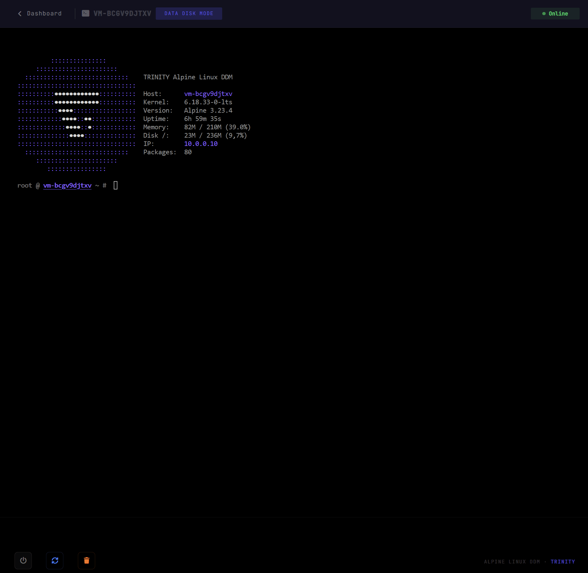

# TRINITY-Architektur
`TRINITY` ist eine Service-Architektur. Auf der öffentlichen Seite verbindet sie mehrere Oberflächen, die konsistent zusammenarbeiten müssen: Website, Kundenkonto, Zahlungen, Support, VM-Betrieb und Dokumentation. Diese Seite erklärt nicht ein internes Framework, sondern beschreibt, wie die Plattform aus Sicht von Nutzern und Betrieb strukturiert ist.

*Die öffentliche Website trägt das `TRINITY`-Versprechen und leitet Nutzer zu Angeboten, Konto, Support und Betrieb weiter.*

## Ebene 1 - Website, Konto und Kundenbeziehung
Die erste Ebene ist die sichtbarste:

- öffentliche Seiten
- kommerzielle Angebote
- Kontakt- und Support-Seiten
- Kontoerstellung und Anmeldung
- Bestellungen, Zahlungen und Rechnungen
- Chat und Assistenz

Diese Ebene macht `TRINITY` zu einem Kundenportal. Hier wird das kommerzielle Angebot mit der tatsächlichen Service-Nutzung verbunden.

## Ebene 2 - Service-Oberflächen
Sobald ein Kunde identifiziert ist, gibt `TRINITY` Zugang zu Service-Oberflächen:

- Bestellverfolgung
- Rechnungsdownload
- Sichtbarkeit des Zahlungsstatus
- Rechnungsinformationen
- Zugriff auf ausgewählte VM-Oberflächen
- Öffnen von Konsolensitzungen

Die Plattform verwaltet damit einen Lebenszyklus und nicht nur klassische Website-Navigation.

## Ebene 3 - VMs, Konsolen und Betrieb
`TRINITY` endet nicht beim Kauf. Die Website bildet auch betriebliche Anwendungsfälle ab:

- Einsicht in eine VM
- Neustart oder Statusverfolgung
- Öffnen einer Konsole
- Zugriff auf einen wartungsorientierten Modus

*Generierte Aufnahme einer `TRINITY`-VM-Ansicht im Data Disk Mode, gedacht für Wartung und Wiederherstellung.*

## Data Disk Mode
Der **Data Disk Mode** ist ein spezieller Zugriffsmodus, wenn eine VM anders behandelt werden muss als ein normal laufender Anwendungsdienst. Öffentlich lässt er sich als Wartungs- oder Wiederherstellungsmodus beschreiben:

- die VM startet in einem reduzierten Kontext
- das Hauptziel ist der Zugriff auf Datenträger und Dateisystem
- der Nutzer kann Zustand prüfen, Fehler analysieren oder eine Umgebung wiederherstellen
- der Modus eignet sich für Wartung, Analyse und Recovery

`TRINITY` zeigt also nicht nur, ob eine Maschine online ist. Die Plattform kann auch einen gezielten Arbeitsmodus für sichere Eingriffe in Daten und Systemzustand bereitstellen.

## Alpine Linux und Xen in der Architektur
Zwei öffentliche Begriffe sind hier zentral:

- **Alpine Linux** ist das schlanke Betriebssystem, das wegen seiner Kompaktheit, Lesbarkeit und Eignung für kontrollierte technische Umgebungen verwendet wird.
- **Xen** ist die Hypervisor-Schicht, mit der virtuelle Maschinen ausgeführt und voneinander isoliert werden.

In `TRINITY` bedeutet das: Kunden bestellen, verfolgen und nutzen Services, die auf Alpine Linux als Systembasis und Xen als Virtualisierungsschicht aufbauen.

## Ergänzende Oberflächen
`TRINITY` ist mit zwei ergänzenden Services verbunden:

- **`UnyDesk`** für Fernzugriff und Assistenz
- **`UnyPort`** für Überwachung, Kontrolle und Sicht auf den Infrastrukturzustand

*Generierte Aufnahme des `UnyPort`-Demo-Dashboards mit Host-Status, Ressourcen und Überwachungsflächen.*

## Gesamtbild
Öffentlich lässt sich die `TRINITY`-Architektur so lesen:

1. eine Website, die präsentiert und verkauft
2. ein Kundenkonto, das verfolgt und abrechnet
3. eine Plattform, die Zahlung, Support und Servicezugang verbindet
4. Alpine-Linux-Umgebungen, virtualisiert mit Xen
5. Betriebsoberflächen wie Konsolenzugriff, Data Disk Mode, `UnyDesk` und `UnyPort`
